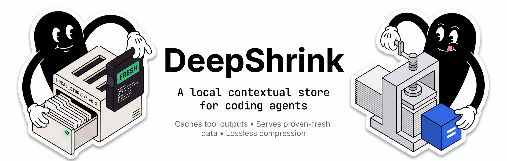
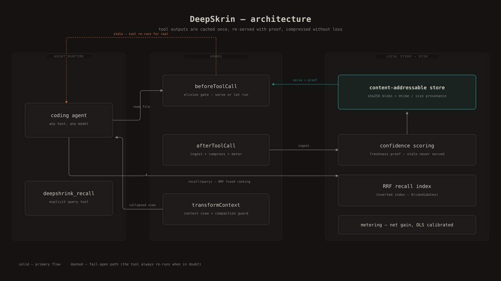

<p align="center">
  
</p>

<p align="center">
  <a href="LICENSE"></a>
  <a href="LICENSE"></a>
  
  
</p>

> **"Compression never changes the meaning."**

DeepSkrin is a context-compression engine for coding agents. Tool outputs (file reads,
greps, commands) are cached in a content-addressable store and re-served with proof
they are still valid. Savings on tool-output tokens: ~80% on the bundled realistic mix
(-91% on API JSON, -29% on git status) - reproduce it with `node bench/run.mjs`.

The core constraint: a compressed output must never mean anything different from the
original. "The hook must not suppress errors" must never become "The hook must suppress
errors", whatever the token cost of preserving it.

---

---

## Why naive caching fails

A naive cache answers "I have seen this read before" and returns the stub. Three failure
modes, all observed in the wild:

1. The file changed since the cached read. The model reasons over stale content with no
   way to know.
2. The stub replaces content the model no longer has in context (post-compaction). It
   believes it has read what it has not.
3. The compression itself inverts meaning: dropping "not" saves 1 token and inverts the
   instruction. The resulting repair loop costs more than the token saved.

DeepSkrin addresses each one structurally, not statistically.

---

## Comparison with existing approaches

An agent's bill is O(reads), not O(edits). Existing approaches, and what they leave on
the table:

| Approach | What it does | What it does not do |
|---|---|---|
| Prompt caching (provider API) | Reuses the already-billed prefix within the same session | Does not reduce volume: the model still re-reads everything in context. Useless cross-session. |
| Anti-reread hooks (tutorials) | Intercepts a previously-seen read, returns a short stub | Exact-key cache without freshness proof. No persistent store, no recall, no metrics. |
| Persistent agent memories | Multi-layer memory for reasoning | Not a tool-output cache. No staleness detection, no elision, no fidelity guarantee. |
| Context compaction | Summarizes history when context overflows | Destructive: the original tool output is gone. DeepSkrin is lossless (everything stays recallable) and acts before compaction. |
| Model handoff (prewalk) | Frontier model plans, cheap model executes | Moves reads to a cheaper model, does not eliminate them. Orthogonal: the two combine. |

Full write-up in [DIFFERENTIATION.md](./DIFFERENTIATION.md).

---

## Architecture

<p align="center">
  
</p>

Tool outputs enter through the host's hooks. `afterToolCall` ingests each output into
the content-addressable store with mtime + size provenance. On the next identical
`read_file`, `beforeToolCall` asks the confidence scorer: proof still valid means the
stored content is served and the original command never actually runs (the call is
rewritten to a no-op); anything stale means the tool re-runs for real. `transformContext`
keeps the context view lossless across compactions, and the meter reports the session net
gain (savings minus injected overhead) in `/deepshrink stats`.

---

## Guarantees

| Guarantee | Mechanism |
|---|---|
| Meaning never changes | Negation words (`ne/pas/jamais/not/never/nicht/kein...`) are structurally impossible to drop, and errors are never hidden. When large texts are crushed, URLs, dates, versions, hashes, amounts (units/currency) and identifiers are force-kept whatever the token cost - the full text stays recallable. |
| Freshness is proven | `read_file` blobs are re-verified by mtime + size at serve time. Identical: serve. Different: score drops by 60 and the blob is never served as content. Web and git results get their own volatility policies and time decay. |
| Stale content is never served | A blob below the stale threshold (score < 40) returns as a hint (reference + reason, no content). Tool elision (`beforeToolCall`) lets the real tool run. |
| Zero information loss | Every tool output is stored in full (sha256 content-addressable store) and recoverable via `deepshrink_recall` with a confidence score. The store is bounded (256 MB / 40k blobs by default, configurable): beyond the cap the oldest non-active blobs are evicted from disk. |
| Measured, not assumed | Every compression must produce a strictly smaller output, and a tool elision ships only when the replacement (reference + served slice) is smaller than the content it replaces - otherwise the tool runs for real. The chars-per-token estimator self-calibrates on real API usage events (OLS fit, ASCII and CJK priced separately). |
| Multi-language | English, French, Spanish, German, accent-normalized (`décision` = `decision`), selectable in the config (`language`). |
| 100% local runtime, zero dependencies | Pure TypeScript. No binaries, no ML libraries, no telemetry. The only outbound request refreshes the public model-pricing grid (used to price tokens and report net gains) - no content ever leaves your machine. |

---

## What it compresses

- API JSON: repetitive arrays become compact tables (`[N=12]{id:int,name:str}` + CSV), up to -90%.
- Stack traces: keeps the error and application frames, folds runtime frames (`[... N frames collapsed]`).
- Grep results: grouped per file with counts (`[Search results: N matches in M files]`).
- git status: compact modified-file lists (names always kept).
- Large texts: keeps salient segments (errors, negations, URLs, versions, dates, amounts, hashes), drops filler.
- Prose: drops filler words in fr/en/es/de, preserves negations and content words.

## The numbers

Reproduce them: `node bench/run.mjs` - bundled corpus, real pipeline, no network.

- ~80% average savings on the bundled realistic mix (JSON, grep, logs, git status, large texts, prose).
- Per category: -91% API JSON, -80% build logs, -89% prose, -89% large texts, -59% grep results, -33% stack traces, -29% git status.
- Your own sessions are metered live: net token gain, cost, re-read rate in `/deepshrink stats`.
- Every stored byte remains recallable with a confidence score (0-100%) and staleness detection.
- Recall runs on an in-memory inverted index with code-aware tokenization: multi-term and path
  queries compare candidates, not the whole store (single-term regex queries fall back to a full
  scan); index size and counters are visible in `/deepshrink status`.

---

## How it works (animated)

| Episode | What it shows |
|---|---|
| Proven Freshness | Every cached blob is re-verified by mtime + size. Stale content is never served. |
|  | |
| Delta Ratio | A changed file is re-served as a Myers-diff patch (≤ 40% changed) instead of the whole file. |
|  | |
| RRF Fuse | Recall ranking: the blob both query signals agree on wins. |
|  | |
| Net Gain | The meter is calibrated on the real API bill. A tool elision ships only if the replacement is cheaper than the content it replaces; every compression must be strictly smaller. |
|  | |
| Negation Guard | Negations are structurally undeletable. Compression can never invert meaning. |
|  | |

---

## Install

```bash
# macOS / Linux
git clone https://github.com/Azertyuiop442/deepshrink.git
cd deepshrink
bash install.sh
```

```powershell
# Windows (PowerShell)
git clone https://github.com/Azertyuiop442/deepshrink.git
cd deepshrink
powershell -ExecutionPolicy Bypass -File install.ps1
```

The installer copies only the runtime files (`core/`, `runtime/`, `entry/`,
`package.json`) into `~/.commandcode/mods/deepshrink`. Assets, tests and docs stay out
of your machine: they are useless at runtime. Restart your Command Code session, then
verify with `/deepshrink status`.

---

## Commands

```
/deepshrink            Main menu (status, stats, recall, store, config, clean...)
/deepshrink on|off     Enable / disable compression
/deepshrink recall     Search stored content (regex + confidence)
/deepshrink stats      Real savings (net token gain)
/deepshrink clean      Purge the store (workspace or everything)
/deepshrink-log        Detailed compression logs
```

## Fail-open rules

- Any doubt: keep the original.
- Output below threshold: untouched.
- Tool elision with a net <= 0 replacement (the note is not smaller than the content): the tool runs for real.
- Prose compression saving < 10%: discarded.
- Errors are never hidden, always shown to the model.
- Observation masking never touches errors, error-flagged results, the first observation, small outputs or the last N outputs; masked text stays recoverable (blob ref or recall).
- Credentials are redacted before anything is stored.

<details>
<summary>Engineering notes (post-compaction fidelity guard, rolling-hash debt)</summary>

Post-compaction fidelity guard: re-reads of unchanged files are elided to a short stub,
but only while the model still has the content in context. After a compaction boundary
(`compaction_start` event or a new summary in `transformContext`) an epoch counter
increments; a blob is stub-eligible only if re-served since the last boundary
(`servedSinceEpoch[hash] === epoch`, LRU ~256). The first re-read after compaction is
always served for real (~24K fidelity budget, bypassing the 2 KB recall budget), then
elision resumes. Telemetry: `fidelityServes`, `stubServes`, `postCompactionStubs`
(must stay ~0), `recallCalls` in `metrics.json` and `/deepshrink status`.
Bootstrap note: numeric-only (~400 chars, filename allowlist, no raw content), injected
once per session via `appendCustomMessageEntry`. `compactGuard` is ON by default.
Delta serve: a re-read whose content changed is served as a Myers patch only when the
previous version was re-served since the last compaction boundary (the same stub-safety
gate) and the change is ≤ 40% - the new version is ingested regardless, so later reads
serve it for real. Windowed re-reads run through the same diff: a requested range outside
the changes becomes an unchanged marker (with the line shift when the file moved above
it), a range containing changes renders the changed blocks plus unchanged markers, and
the serve ships only when the replacement is strictly smaller than the slice it replaces.
`/deepshrink status` reports delta serves and refusal reasons (no prior, stub-unsafe,
ratio, oversize, patch, window).
Known limit: windowed output without compaction ("seen = still in context") remains an
unverifiable-by-hook heuristic.
Observation masking: tool outputs older than the last N (default 8) are replaced with a
recoverable placeholder that keeps the line/char counts (plus the blob ref when the
text is in the store). The cut moves at most every `polling` observations (default 4),
so the prompt prefix stays byte-stable between moves; deterministic, no LLM, errors and
small outputs are exempt. Counters in `/deepshrink status` (`mask:`).
Symbol retrieval: the `deepshrink_symbol` tool serves one named definition (function,
class, struct, ...) with its body and line range from the store, with the same
freshness proof - a file that changed on disk is never served as a definition, it is
reported as a stale candidate.
Context pressure: `/deepshrink status` adds a deterministic reading (growth per turn,
cache ratio, turns since compaction) with advice when the context needs attention; the
dashboard bridge exposes the same signal as a live segment.
Awareness: while enabled, the harness re-injects a one-line hint (appendSystemPrompt) on
every request, so the store tools stay known even after a compaction erased earlier
mentions; elision stubs and masked placeholders repeat the same pointers exactly where
the model is about to re-read.
Project playbook (deterministic): the mod keeps a small per-project list of
the files it actually serves - a fresh serve counts as helpful, a refusal that told you
to re-read counts as harmful - and injects the top entries into the compaction state
summary, so the context that survives a compaction carries proven provenance instead of
guesses. `/deepshrink playbook` shows it; `reset` clears it. Capped, eviction-sorted, no
LLM involved.
Cross-CLI store: `scripts/mcp-server.mjs` serves the same local store over MCP (stdio) to
any MCP client - recall and symbol tools, read-only, with the same freshness proof (a
file that changed on disk is never served as content). Point it at the store with
`DEEPSHRINK_DATA_DIR` and register it in your client.

</details>

---

## Community

<p align="center">
  
  &#160;
  <a href="https://x.com/astra442"></a>
</p>

Issues and pull requests welcome - see [CONTRIBUTING.md](./CONTRIBUTING.md).

---

## License

AGPL-3.0. Any fork or redistribution (including as a network service) must republish
the modified source under AGPL-3.0 and retain attribution notices. Commercial license
available on request: contact the author.
